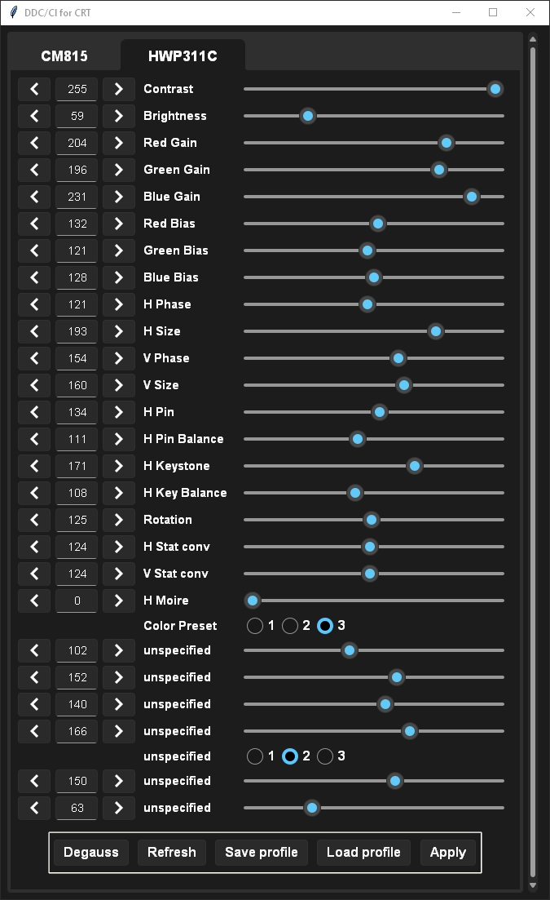

# DDC-for-CRT

This program creates a GUI with as many CRT related features as are supported by the connected monitor.

<div align="center">
  


</div>

## Credits
rdbende's [Sun-Valley](https://github.com/rdbende/Sun-Valley-ttk-theme) tkinter theme

newAM's [monitorcontrol](https://github.com/newAM/monitorcontrol) API

## Installing from source
Install [Python](https://www.python.org/downloads/windows/) with `pip` for windows 

clone repository, change to the DDC-for-CRT directory and run

```
pip install --upgrade .
```

## Running

open the executable of your choice

if installed from source:

run `crtgui` or `crtguiverbose` to see console output
